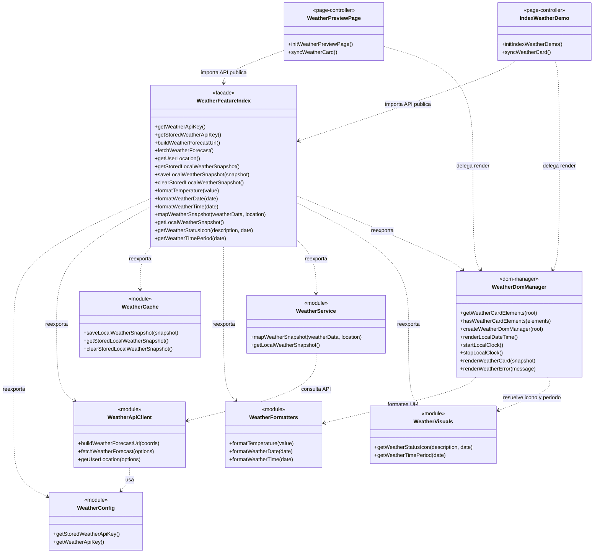

## Weather API feature

Esta carpeta contiene solo la capa de consumo de la API del tiempo.

## Diagrama visual




Objetivo de esta feat:
- encapsular geolocalizacion
- encapsular llamada HTTP a OpenWeather
- encapsular cache local
- dejar utilidades listas para una futura pantalla con card de clima
- centralizar el pintado del DOM en un DomManager reutilizable
- encapsular una capa visual reutilizable para iconos y modo dia/noche

### API publica

- `getLocalWeatherSnapshot()`
- `getStoredLocalWeatherSnapshot()`
- `saveLocalWeatherSnapshot(snapshot)`
- `clearStoredLocalWeatherSnapshot()`
- `formatTemperature(value)`
- `formatWeatherDate(date)`
- `formatWeatherTime(date)`
- `getWeatherStatusIcon(description, date)`
- `getWeatherTimePeriod(date)`
- `createWeatherDomManager(root)`

### Configuracion

Antes de usar esta feature, define la key en runtime:

```html
<script>
  window.H2O_PLEASE_WEATHER_API_KEY = "tu-api-key";
</script>
```

Tambien puedes guardarla en localStorage durante desarrollo:

```js
localStorage.setItem("H2O_PLEASE_WEATHER_API_KEY", "tu-api-key");
```

Para trabajo normal entre ramas, usa estos archivos:

- `scripts/config/weatherRuntimeConfig.example.js`:
  plantilla trackeada para que la estructura viaje a `dev` y `main`
- `scripts/config/weatherRuntimeConfig.local.js`:
  archivo local ignorado por Git donde va la key real

En pantallas que usen el clima, carga antes este script:

```html
<script src="scripts/config/weatherRuntimeConfig.local.js"></script>
```

### Integracion futura

Cuando se cree la pantalla final de clima, esa pantalla solo tendra que:

1. pedir `getLocalWeatherSnapshot()`
2. guardar o leer cache local si hace falta
3. crear `createWeatherDomManager()`
4. resolver icono y periodo visual
5. pintar la card con temperatura, clima, fecha y hora local

### Estado visual actual

La feature ya tiene una base visual utilizable:
- card redisenada con mejor jerarquia visual
- pildora de estado con icono minimalista
- modo visual dia/noche
- DomManager compartido para reutilizar el render de la card
- preview aislada para revisar UI sin tocar el dashboard

La UI se deja fuera de esta feat a proposito para poder unir esta rama a `dev`
sin mezclar todavia la pantalla final.

### Preview local

Para ver una card funcional sin tocar la home principal, abre:

```text
/weather-preview.html
```

Esa vista usa esta misma feature y sirve como pantalla de prueba local.

Tambien existe una integracion de ejemplo en:

```text
/
```

El `index` de prueba carga la misma feature mediante `scripts/pages/indexWeatherDemo.js`.
